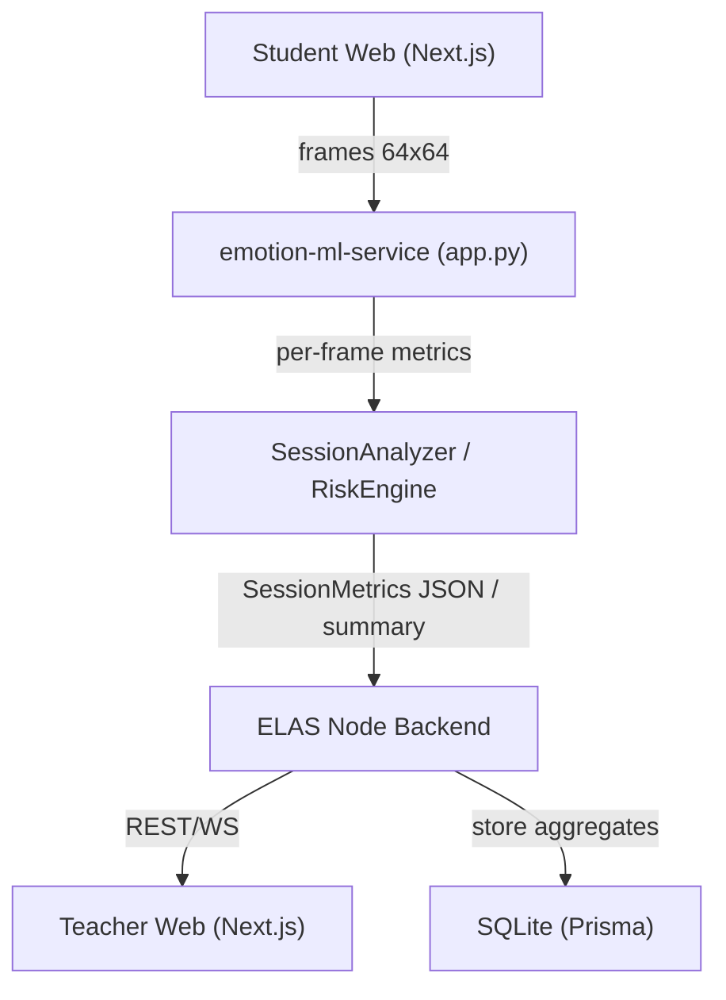

# ELAS ML‑Analytics Integration — дизайн связки Node ↔ emotion-ml-service

Цель: описать, **в каком формате** Node‑бэкенд ELAS должен получать/хранить результаты аналитики от Python‑сервиса `emotion-ml-service`, и как эти данные использовать на страницах:

- `teacher/session/[id]/analytics`
- `teacher/session/[id]/exam-analytics`
- сравнения сессий / отчёты.

Базовый источник правды по ML‑части — `emotion-ml-service/docs/AGENT_BRIEFING.md`.

---

## 1. Поток данных (high-level)



### 1.1 Уже реализовано

- Student Web (`student/session/[id]`) раз в ~600 мс:
  - снимает кадр с камеры → `captureFrame64x64Grayscale`,
  - шлёт его в `emotion-ml-service/backend/app.py` (`POST /analyze`),
  - получает `{ emotion, state, risk, confidence, dominant_emotion }`,
  - отображает бейджи,
  - отправляет метрики в Node: `POST /sessions/:id/metrics` (пер-юзер).
- Node:
  - хранит **текущие** ML‑метрики в in‑memory `liveMetricsStore` (см. `backend/src/http/sessions.ts`),
  - агрегирует `avgRisk`, `avgConfidence` и возвращает их через `GET /sessions/:id/live-metrics`.
- Teacher Web (`teacher/session/[id]`) через `GET /sessions/:id/live-metrics`:
  - показывает список участников + средний риск/уверенность,
  - даёт кнопку «Отправить в чат» (system‑message с avgRisk).

### 1.2 Чего не хватает

Для страниц `analytics` и `exam-analytics` нужны **агрегаты сессии**, которые уже умеет считать Python:

- `SessionMetrics.to_dict()` (см. briefing, раздел 6.3):
  - averages (engagement, stress, fatigue, risk, stability),
  - initial/final,
  - changes/trends,
  - attention_drops,
  - confidence_segments,
  - student_metrics по участникам.

Нужно:

1. Определить REST‑контракты между Node и ML‑сервисом для работы на уровне **сессии**, а не отдельных кадров.
2. Определить, какие части `SessionMetrics` будут:
   - храниться в БД (SQLite),
   - подгружаться напрямую из ML‑сервиса (lazy fetch),
   - использоваться на каких страницах UI.

---

## 2. Предлагаемые API Node ↔ ML‑сервис

Сохраняем Python‑сервис независимым (он сам умеет считать и экспортировать JSON/summary).

### 2.1 Запуск/остановка аналитики сессии

Добавить в ML‑сервис (или обернуть существующую логику сессии) эндпоинты:

- `POST /ml/sessions/start`
  - body:
    ```json
    {
      "session_id": "uuid",
      "title": "Web Programming — React Intro",
      "type": "lecture",
      "scenario": "SCHOOL"
    }
    ```
  - ML инициализирует внутренний буфер и логику SessionAnalyzer для этой сессии.
- `POST /ml/sessions/stop`
  - body: `{ "session_id": "uuid" }`
  - ML завершает сессию, считает финальные агрегаты и сохраняет JSON где‑то локально (или возвращает прямо в ответе).

Связь с Node:

- Node, когда статус сессии меняется на `active` (`PATCH /sessions/:id`):
  - делает `POST /ml/sessions/start`.
- Когда статус меняется на `finished`:
  - делает `POST /ml/sessions/stop`.

### 2.2 Получение сводки по сессии

Новый эндпоинт в ML‑сервисе:

- `GET /ml/sessions/:id/summary`
  - Возвращает JSON, совместимый с `SessionMetrics.to_dict()`:
    ```json
    {
      "session_id": "...",
      "session_name": "...",
      "start_time": "...",
      "end_time": "...",
      "duration_seconds": 3600,
      "averages": { "engagement": 0.6, "stress": 0.2, ... },
      "initial": { ... },
      "final": { ... },
      "changes": { ... },
      "patterns": { "engagement_trend": "DECREASING", ... },
      "total_students": 18,
      "student_metrics": {
        "student_1": { "avg_engagement": 0.7, ... },
        "...": {}
      },
      "attention_drops": [ { "participant_label": "Participant 3", "start_time": "...", "duration_sec": 420, "min_engagement": 0.1 } ],
      "confidence_segments": { "start": 0.8, "middle": 0.6, "end": 0.7 }
    }
    ```

Node‑бэкенд:

- Добавляет прокси‑эндпоинт:
  - `GET /sessions/:id/analytics-summary`:
    - находит session в своей БД,
    - делает `GET` на ML `/ml/sessions/:id/summary`,
    - кэширует результат в собственной таблице `SessionAggregate` (или существующей `session_aggregates` в ТЗ),
    - возвращает фронтенду нужный срез данных.

---

## 3. Структура хранения в БД (Node)

Для диплома **не обязательно** сохранять весь `SessionMetrics` в SQLite, но полезно иметь агрегаты для быстрых запросов и сравнений.

### 3.1 Модель `SessionAggregate` (предлагаемая)

Можно добавить в `backend/prisma/schema.prisma` модель:

```prisma
model SessionAggregate {
  sessionId   String   @id
  payloadJson String   // полный SessionMetrics.to_dict() как JSON-строка
  createdAt   DateTime @default(now())

  session Session @relation(fields: [sessionId], references: [id], onDelete: Cascade)
}
```

Плюсы:

- не нужно разносить по множеству таблиц,
- можно легко доставать отдельные поля на уровне Node/TypeScript,
- для диплома вполне достаточно.

Использование:

- При `GET /sessions/:id/analytics-summary`:
  1. Смотрим, есть ли запись в `SessionAggregate` для этой сессии.
  2. Если есть → парсим `payloadJson` и отдаём фронту.
  3. Если нет → обращаемся в ML `/ml/sessions/:id/summary`, сохраняем и отдаём.

---

## 4. Связь с UI страницами

### 4.1 `teacher/session/[id]/analytics`

На этой странице нужен **обзор лекции**:

- сверху:
  - `averages.engagement`, `averages.stress`, `averages.risk`,
  - `patterns.engagement_trend`,
  - общее количество студентов,
  - возможно, `tz_state_distribution` (если включим).
- графики:
  - timeline вовлечённости/стресса — можно взять из `SessionMetrics` по `timeline` (если добавим в JSON) или сгенерировать из `attention_drops` и `student_metrics`.
- список `attention_drops`:
  - использовать поле `attention_drops`:
    - для каждой записи выводить участника (participant_label), интервал и минимальную вовлечённость.

API:

- Фронтенд вызывает `GET /sessions/:id/analytics-summary` и рисует данные по заранее согласованным ключам.

### 4.2 `teacher/session/[id]/exam-analytics`

Для экзамена нужны дополнительные метрики:

- `confidence_segments` (`start/middle/end`),
- `patterns.stress_peaks`,
- `student_metrics` (по каждому участнику).

UI:

- карточки с `confidence start/middle/end`,
- график стресса во времени,
- таблица по студентам:
  - avg_stress,
  - max_stress,
  - стабильность,
  - участие (frames / time).

Всё это уже есть или легко добавляется в структуру `SessionMetrics` на ML‑стороне.

### 4.3 Сравнение сессий

Для страницы `teacher/compare` можно:

- на Node добавить эндпоинт:
  - `GET /analytics/compare?sessionIds=...`:
    - достаёт `SessionAggregate` для двух‑четырёх сессий,
    - возвращает массив `{ sessionId, title, date, averages, patterns }`.
- фронтенд строит сравнительные графики.

---

## 5. Жизненный цикл аналитики

1. Teacher создаёт сессию в Node (`POST /sessions`).
2. При первом переходе в LIVE:
   - Node:
     - ставит статус `active`,
     - дергает `POST /ml/sessions/start`.
3. Во время сессии:
   - Student Web уже шлёт кадры в ML (`/analyze`) и метрики в Node (`/sessions/:id/metrics`).
   - Node может дополнительно слать в ML только кадры/эмоции (опционально, если ML сам должен знать о sessionId).
4. При завершении:
   - Node меняет статус session на `finished`,
   - вызывает `POST /ml/sessions/stop`.
5. При открытии страницы аналитики:
   - Node делает `GET /ml/sessions/:id/summary` (если ещё не кэширован),
   - сохраняет `SessionAggregate`,
   - отдаёт фронту срез данных.

---

## 6. Вывод

- Формат аналитики берём напрямую из `SessionMetrics.to_dict()` (описан в briefing) и заворачиваем его в Node‑эндпоинт `/sessions/:id/analytics-summary`.\n- Node служит прослойкой между ML‑сервисом и фронтендом:
  - хранит кэш агрегатов (`SessionAggregate`),
  - обеспечивает авторизацию и права доступа (teacher видит только свои сессии, admin — все),
  - адаптирует JSON под нужды UI (обзор, exam‑analytics, compare).
- Таким образом, фронтенд ELAS остаётся «тонким клиентом» для аналитики: он не знает внутреннюю структуру `SessionAnalyzer`, а работает через единый REST‑контракт Node.\n","*** End Patch"}]}/>
